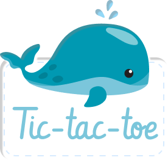
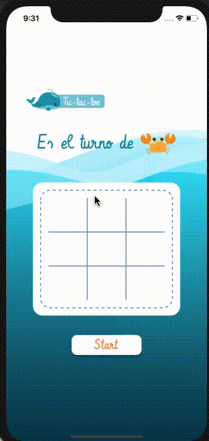

## Definición del producto 

El tres en línea, también conocido como Ceros y Cruces, tres en raya, Michi, juego del gato, Triqui, Cuadritos, Gato, Tatetí, Totito, Triqui traka, Equis Cero, Tic-Tac-Toe, o la vieja, es un juego de lápiz y papel entre dos jugadores: O y X, que marcan los espacios de un tablero de 3×3 alternadamente.

## Usuario Objetivo

Nuestro público objetivo son niños en edad pre-escolar, es por esto que el diseño del juego es ilustrativo, intuitivo y educativo, con botones grandes y poco o nada de texto.

## Herramientas de desarrollo

Este proyecto fue construido con React Native la cual es una herramienta que nos permite construir aplicaciones nativas para Android e iOS usando JavaScript y React.

## Diseño UI 
### Jugadores
  
 
#

## Ejemplo de uso 

