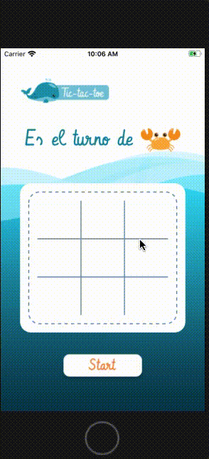

# Tic tac toe 

Es un simple videojuego de _3 en raya_, también conocido como _gato_, _michifús_ o _tic tac toe_ en inglés, para celulares.

Nuestro público objetivo son niños en edad pre-escolar.

## Resumen del proyecto

Este proyecto fue construido con React Native la cual es una herramienta que nos permite construir aplicaciones nativas
para Android e iOS usando JavaScript y React.

## Producto Final

